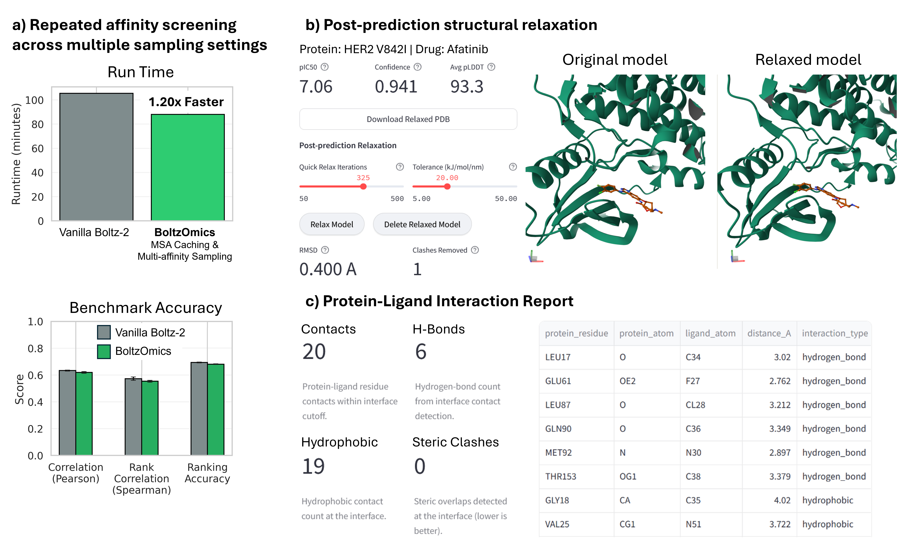

BoltzOmics is an interactive platform for deep learning-driven pharmacogenomic analysis. It leverages the Boltz-2 structure prediction model to assess how genetic mutations affect drug binding. Designed as a standalone Streamlit application, it offers an end-to-end solution for researchers in computational biology, pharmacology, and precision medicine, enabling the study of mutation effects on protein-ligand interactions.


---

## Key Features

*   **State-of-the-Art Structure Prediction**: Utilizes Boltz-2 to generate high-quality 3D structures of protein-ligand complexes from sequence alone.
*   **Automated Mutation Discovery**: Queries the UniProt database to automatically find known mutations for your protein of interest. It integrates pre-computed SIFT and PolyPhen scores from the EBI Proteins API to provide insights into the functional impact of these variants.
*   **Manual Mutation Specification**: Allows users to manually input specific mutations of interest.
*   **Comprehensive Screening Modes**:
    *   *Protein-Drug Screening*: Test a panel of drugs against one or more proteins.
    *   *Mutation-Drug Screening*: Evaluate the effect of specific mutations on the binding of one or more drugs.
    *   *Structure-Only Mode*: Predict the structure of a protein without a ligand.
*   **Flexible and Customizable**: Supports multi-chain proteins, essential co-factors, post-translational modifications, and advanced modeling constraints.
*   **Interactive Visualization**: Includes an integrated 3D molecular viewer and a suite of plots to analyze binding affinity and structural quality metrics.
*   **User-Friendly Interface**: Implemented as a Streamlit application for easy local deployment and interaction.

---

## Setup and Installation

To set up and run BoltzOmics, follow these steps:

### Prerequisites

*   Python 3.12 or higher
*   Conda (Miniconda or Anaconda, see: https://www.anaconda.com/docs/getting-started/miniconda/install)
*   **NVIDIA GPU**: An NVIDIA GPU is highly recommended for optimal performance due to the computational intensity of the deep learning models.

### 1. Clone the Repository

First, clone this GitHub repository to your local machine by typing the following commands in the terminal:

```bash
git clone https://github.com/k-ngo/boltzomics.git
cd boltzomics
```

### 2. Create and Activate Conda Environment

In the terminal, create a new Conda environment and activate it:

```bash
conda create -n boltzomics python=3.12 -y
conda activate boltzomics
```

### 3. Install Dependencies

Install the required Python packages:

```bash
pip install -r requirements.txt
```

### 4. Run the Application

Once all dependencies are installed, you can launch the Streamlit application:

```bash
streamlit run boltzomics.py
```

This command will open the application in your web browser. If the browser does not automatically open or if running on a remote machine (e.g. through SSH connection), the Streamlit server will provide a URL (e.g., `http://localhost:8501` or an external IP address) that you can access from the web browser of your local machine to interact with the application.

---

## Usage

The application provides an intuitive interface for performing pharmacogenomic screenings.

1.  **Input Protein Sequence**: Provide your wild-type protein sequence or identifier.
2.  **Define Mutations**: Choose to either automatically discover known mutations from databases or manually specify mutations (e.g., `Y652A`, `F656A`).
3.  **Input Ligands**: Enter SMILES strings for the drugs you wish to screen.
4.  **Configure Parameters**: Adjust optional parameters for advanced modeling.
5.  **Run Prediction**: Initiate the structure prediction and screening process.
6.  **View Results**: Explore interactive plots, result tables, and 3D molecular visualizations of the predicted protein-ligand complexes.

---

## Workflow Capabilities Beyond Vanilla Boltz-2

Boltz-2 is a strong prediction engine, but on its own it is usually used one protein–ligand pair at a time, with one setting at a time, and with most of the surrounding work left to the user. In real mutation screens, that surrounding work is often the bottleneck: deciding which variants to test, avoiding repeated preprocessing, checking whether results depend on sampling settings, and interpreting whether a predicted affinity change makes structural sense.

BoltzOmics keeps Boltz-2 as the core predictor, but adds a full mutation-screening workflow around it. The goal is not just to get one prediction, but to make repeated mutant–drug studies easier to run, easier to trust, and easier to interpret.



### Examples of workflow-level capabilities implemented in BoltzOmics beyond a standard single Boltz-2 run.  
**(a)** Example HER2 benchmark showing repeated affinity screening across three sampling settings. Using affinity multi-sampling together with MSA caching reduced runtime from 105.5 min for three separate manual runs to 88.1 min in the integrated workflow (1.20× faster; 16.5% runtime reduction) while maintaining similar accuracy on the shared evaluated set.  
**(b)** Optional post-prediction structural relaxation within the interface, shown here for HER2 V842I bound to afatinib, including side-by-side visualization of the original and relaxed models together with refinement metrics.  
**(c)** Integrated protein–ligand interaction report, including contact counts, hydrogen bonds, hydrophobic interactions, steric clashes, and a residue-level interaction table.  
Together, these panels show why BoltzOmics is useful in practice: it does not just run Boltz-2, it helps users screen repeated mutant–drug jobs more efficiently, inspect setting sensitivity, and interpret the structural meaning of the results.

#### Mutation discovery and prioritization
When screening variants, the hardest part is often deciding **what to run first**. BoltzOmics can discover known mutations for your input protein, map them correctly to your sequence, and enrich them with annotations such as SIFT, PolyPhen-2, AlphaMissense, and clinical significance when available.

Why this matters:
- You can quickly focus on variants that are more likely to impact structure/function and drug binding.

When to use it:
- You have many possible variants and need a rational shortlist.

How to use it:
- Go to `Advanced Options` -> `Mutation Discovery`
- Click `Discover Mutations`
- Optional: open `AlphaMissense Prioritization (Optional)` and enable `Use AlphaMissense-Informed Prioritization`

---

#### Mutation-centered pocket steering
Some mutations sit near the binding pocket and may change how the ligand is positioned locally. BoltzOmics can automatically define a mutation-centered local region and use it to guide sampling.

Why this matters:
- It is especially useful when you already suspect the mutation acts near the binding site.
- It helps focus the drug binding prediction on the region most likely to matter.

When to use it:
- The mutation is near the known or suspected drug-binding region.

How to use it:
- Go to `Advanced Options` -> `Mutation Discovery` -> `Mutation-Conditioned Pocket Steering`
- Enable `Enable Mutation Steering`
- Optional: adjust `Neighborhood Window (± residues)`, `Steering Max Distance (Å)`, and `Enable Boltz Potentials (--use_potentials)`

---

#### MSA cache reuse
Repeated mutant screens often waste time regenerating nearly identical MSAs. BoltzOmics reuses compatible MSA results across related WT and mutant jobs whenever possible.

Why this matters:
- It avoids repeating the same preprocessing work over and over.
- It reduces dependence on repeated external MSA generation (e.g., MSA server).
- It makes larger mutation panels much easier to run in practice without trigger MSA quota limits.

When to use it:
- You are screening many mutants of the same protein.
- You are testing many ligands against related WT and mutant sequences.

How to use it:
- In the main settings, keep `Enable MSA Cache` ON

---

#### Multi-affinity sampling with consensus output
A common question in Boltz-2 usage is: **which affinity setting should I trust?**  
BoltzOmics addresses this directly by generating the structure once, then reevaluating the affinity stage across multiple settings on the same structural output. It reports the per-setting results and can also return a consensus median as the default final value.

Why this matters:
- You can see whether the result is stable across settings instead of trusting one arbitrary configuration.
- You do not need to rerun the full structure prediction for every new affinity setting.

When to use it:
- You want more stable affinity reporting.
- You want to know whether a conclusion depends strongly on the chosen sampling setting.
- You are preparing results for screening, benchmarking, or publication.

How to use it:
- Enable `Enable Affinity Multi-Sampling (Structure Once, Affinity Sweep)`
- Set `Multi Sampling Steps (Affinity)` and `Multi Diffusion Samples (Affinity)`
- Keep `Use Full Consensus (Median) as Final Affinity (Recommended)` ON for default reporting

---

#### Interaction report with PLIP
A predicted affinity shift is much more useful when you can inspect **why** it may have changed. BoltzOmics includes a built-in protein–ligand interaction report with residue-level detail.

Why this matters:
- It helps connect affinity differences to actual contact changes.
- You can inspect hydrogen bonds, hydrophobic contacts, clashes, and interface residues directly.
- It gives structural evidence that can support follow-up experiments.

When to use it:
- You need more than just one score per mutant–drug pair.
- You want to compare WT and mutant binding patterns in a mechanistic way.
- You are preparing figures or evidence for a report or manuscript.

How to use it:
- In results, open `3D Structure Visualization`
- Inspect `Protein-Ligand Interaction Report`
- Expand the contributor tables for residue-level details

---

#### Post-prediction relaxation with OpenMM
Predicted models sometimes contain local strain or clashes that make visual interpretation harder. BoltzOmics lets you run optional structural relaxation directly in the interface.

Why this matters:
- It can reduce local steric strain before structural inspection.
- You can compare the original and relaxed structures side by side.

When to use it:
- You suspect local clashes or strained geometry.
- You want to check whether a small refinement changes the local binding environment.

How to use it:
- In `3D Structure Visualization`, open `Post-prediction Relaxation`
- Click `Relax Model`
- Click again to continue minimization if needed
- Use `Delete Relaxed Model` to reset

---

## Suggested Usage Patterns

### 1. Screening a large mutation panel
Use mutation discovery to generate a variant list, then optionally apply AlphaMissense-informed prioritization to focus the first pass on more informative variants. Keep MSA caching enabled to avoid repeated preprocessing across related mutants.

### 2. Getting a stable affinity estimate
Enable multi-affinity sampling and keep the full consensus median on. This is the best default when you want less dependence on any one affinity setting. The median is less sensitive to an outlier setting than the mean and is a conservative default when comparing multiple sampling profiles.

### 3. Understanding why a mutant changed binding
After prediction, open the 3D visualization, inspect the interaction report, and use post-prediction relaxation if needed before comparing WT and mutant structures.

---

## Q&A

**Q: Should I always enable MSA cache?**  
A: For repeated mutation or drug screens, yes. It reduces redundant preprocessing and makes larger studies easier to run.

**Q: Should I always enable multi-affinity sampling?**  
A: It is recommended for screening and for any case where you want to know whether the result depends on the chosen affinity setting.

**Q: When should I run post-prediction relaxation?**  
A: Use it when local strain or clashes are suspected, or when you want a cleaner structure for visualization and interaction inspection.

---
# BoltzOmics command-line guide

Run BoltzOmics screenings from a YAML or JSON manifest without opening the Streamlit interface. The CLI reads protein sequences and ligand SMILES from files or directly from the manifest, then saves results in the same project folders used by the app.

## 1. Set up BoltzOmics

Follow the [README installation steps](README.md#setup-and-installation), activate the BoltzOmics environment, and run commands from the repository folder. Check the available commands with:

```bash
python boltzomics_cli.py --help
```

## 2. Prepare your inputs

Start with [examples/cli_job.yaml](examples/cli_job.yaml). It references [a protein FASTA file](examples/cli_proteins.fasta) and [a ligand CSV file](examples/cli_ligands.csv). Paths in a manifest are relative to the manifest itself.

The ligand CSV needs a header row with a name column and a SMILES column. For example:

```csv
name,smiles
Aspirin,CC(=O)Oc1ccccc1C(=O)O
Caffeine,Cn1c(=O)c2c(ncn2C)n(C)c1=O
```

You can also put proteins and ligands directly in the manifest:

```yaml
project_name: small_screen
proteins:
  - name: WT
    sequence: MKTAYIAKQRQISFVKSHFSRQLEERLGLIEVQANL
  - name: R10K
    sequence: MKTAYIAKQKQISFVKSHFSRQLEERLGLIEVQANL
ligands:
  - name: compound_a
    smiles: CCO
```

To run without ligands, set `structure_only: true` and omit `ligands`.

## 3. Run a screening

Submit the example manifest and wait for the CLI queue to finish:

```bash
python boltzomics_cli.py run examples/cli_job.yaml
```

The command prints a JSON summary and returns a nonzero exit code if a job in the manifest's project fails. Existing valid results are reused by default; set `use_existing_results: false` in the manifest to run them again.

## GPU options

`gpu_mode: auto` is the default. When multiple GPUs are detected, jobs are distributed across them, one job per GPU. The worker count defaults to the number of assigned GPUs and can be changed with the top-level `workers` setting or the `--workers` command option.

To choose GPUs yourself, add this to the manifest:

```yaml
gpu_mode: auto
workers: 2
settings:
  queue_gpu_devices: ["0", "1"]
```

Set `gpu_mode: single` and `workers: 1` to run one job at a time on one GPU. For CPU execution, set both `settings.accelerator: cpu` and `settings.use_gpu: false`.

## Run jobs with a separate worker

Use `submit` to add jobs to the persistent CLI queue without starting predictions:

```bash
python boltzomics_cli.py submit examples/cli_job.yaml
```

Start the worker in a terminal. It processes queued jobs and exits when the queue is empty:

```bash
python boltzomics_cli.py worker
```

While the worker runs, use another terminal to check progress or wait for a project to finish:

```bash
python boltzomics_cli.py status --project lysozyme_cli_demo
python boltzomics_cli.py wait --project lysozyme_cli_demo
```

Submit all manifests before starting the worker. Wait for it to exit before running queue-changing commands such as `submit`, `retry`, or `cancel`. The CLI queue is separate from the Streamlit queue, but both write results to the same project folder.

## Manage jobs and export results

Retry failed jobs, then start a worker to run them again:

```bash
python boltzomics_cli.py retry --project lysozyme_cli_demo
python boltzomics_cli.py worker
```

Cancel removes pending jobs; it does not stop a prediction that is already running:

```bash
python boltzomics_cli.py cancel --project lysozyme_cli_demo
```

Export project results as CSV or JSON:

```bash
python boltzomics_cli.py results --project lysozyme_cli_demo --format csv --output results.csv
python boltzomics_cli.py results --project lysozyme_cli_demo --format json --output results.json
```

## Common manifest options

The manifest supports YAML and JSON. A file-based manifest looks like this:

```yaml
project_name: my_screen
structure_only: false
proteins:
  fasta_file: proteins.fasta
ligands:
  csv_file: ligands.csv
  name_column: name
  smiles_column: smiles
gpu_mode: auto
use_existing_results: true
settings:
  recycling_steps: 4
  sampling_steps: 200
  diffusion_samples: 1
  enable_msa_cache: true
```

Add `protein_drug_filter` to run selected protein/ligand pairs only:

```yaml
protein_drug_filter:
  enabled: true
  pairs:
    - [WT, compound_a]
```

Prediction options go under `settings`. They use the same names and structures as the Streamlit controls; the CLI rejects unknown options before queueing jobs. For advanced options such as affinity multi-sampling, pocket constraints, templates, or mutation steering, copy the corresponding setting structure from the app configuration. MSA credentials should be supplied through environment variables (`BOLTZ_MSA_USERNAME` and `BOLTZ_MSA_PASSWORD`, or `MSA_API_KEY_VALUE`), not stored in the manifest.
